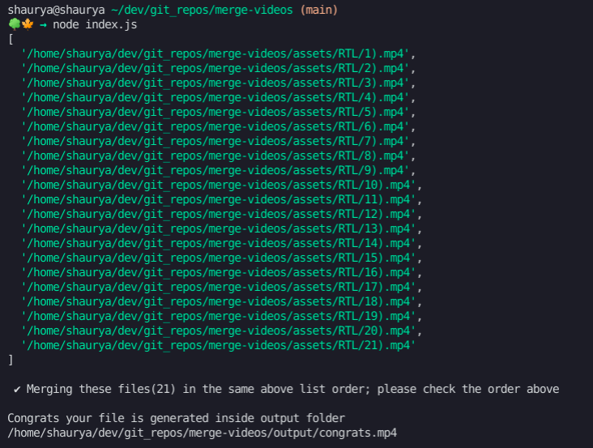
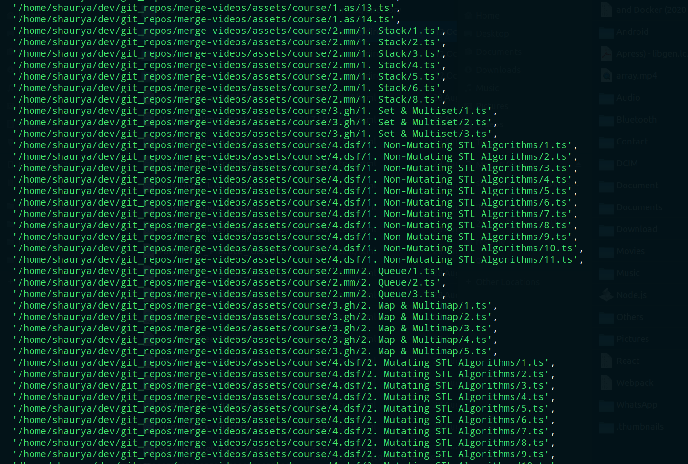

# 🏆 merge-videos

😁😁 Merge Videos inside a directory into a Single Video file :)

## 🥅 You wish to merge all videos inside a folder into one video

Let's say you wish to merge videos inside `Learn Merging Videos` folder like

```cmd
Learn Merging Videos
└── 1. Section A
  ├── 1. Learn Merging I.mp4
  ├── 2. Learn Merging II.mp4
  ├── 3. Learn Merging III.mkv
  ├── 4. Learn Merging IV.mkv
  ├── 5. More.html
└── 2. Section B
  ├── 1. Learn MergingB I.mp4
  ├── 2. Learn MergingB II.txt
  ├── 3. Learn MergingB III.mp4
└── 3. Section C
  ├── 1. Learn MergingC I.txt
  ├── 2. Learn MergingC II.mp4
  ├── 3. Learn MergingC III.mp4
  ├── 4. Learn MergingC IV.txt
  ├── 5. Learn MergingC V.mkv
  ├── 6. Learn MergingC VI.mp4
  ├── 7. Learn MergingC VII.txt
  ├── 8. Learn MergingC VIII.mp4
  ├── 9. Learn MergingC IX.mp4
  ├── 10. Learn MergingC X.txt
  ├── 11. Learn MergingC XI.mp4
  ├── 12. Learn MergingC XII.mp4
└── 4. Section D
  ├── 1. Learn MergingD I.mp4
  ├── 2. Learn MergingD II.mp4
  └── 3. Learn MergingD III.mp4

```

and you wish to merge the mp4 or mkv or m4v files together just

### 🍿 Follow these steps

- Star and Clone this Repo into your Computer.

  ```cmd
  git clone https://github.com/jugshaurya/merge-videos.git

  ```

- Copy/Move the `Learn Merging Videos` folder(you wish to merge) into assets folder.

- Change directory to the local merge-video repo

  ```cmd
  cd merge-videos
  ```

- Install Dependencies

  ```cmd
  yarn
  ```

- Execute the below command and wait for something to be printed on the screen. When something prints, outputfile is generated congrats!😁 or some error occured.😤. Feel free to open a issue or PR.

  ```cmd
  node index.js
  ```

- Congrats!, you got all the video files merged into output directory as congrats.mp4

- If you wish to do the same with one more video folder, delete the added folder from the assets folder and congrats.mp4 from output(optional but will `override` the previous generated congrats.mp4) and follow the steps again.

output will here:-

```cmd
└── output
  ├── congrats.mp4

```

### 🤕 Note/Beware:

Please make sure all videos and folders name are marked with `<number>.<anything>` i.e. `1.something` `2.somethingelse` and so on...

## Peek a boo!



### Stretch and Rethinking

- [ ] Let user input the output filename.
- [ ] Let user input the output path.
- [ ] Write tests via jest.
- [ ] Create a command (node jugshaurya clean) to delete files from assets and output folder.
- [ ] Add timestamp to the generated congrats\_[timestam].mp4 file, so to merge more videos without deleting congrats.mp4 first and update corresponding rule from readme(point before output will be there!).

### Important/Maybe/open-a-issue

- [ ] Add a preprocessing step

  - get all the mp4 files from deep down into the root folder, rename them into order 1,2,3,4,5,....... and then merge.

- [ ] Showing error for the gfg stl course(dfs problem, check code, create visited array for each node.)
      
